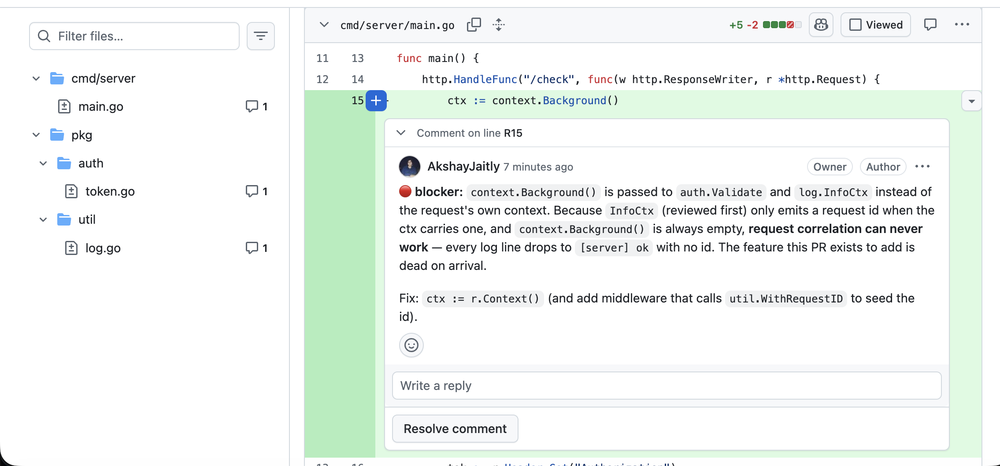
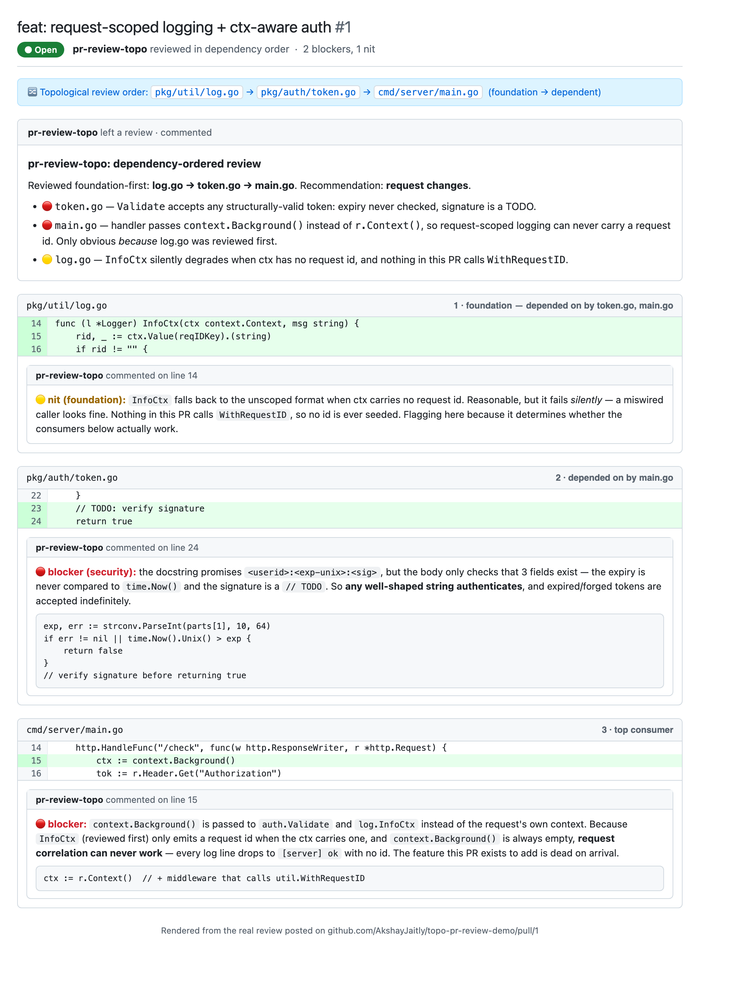

# pr-review-topo

A [Claude](https://claude.com/claude-code) **skill** that reviews a pull
request in **topological (dependency) order** — foundational files first,
dependents last — so each file is reviewed with full context of everything it
builds on.

## What a review looks like

A real review produced by this skill, posted as inline comments on a GitHub PR
in topological order (foundation → dependent). Note the file tree — every
changed file (`main.go`, `token.go`, `log.go`) carries a comment, and the
`context.Background()` blocker is anchored right on line R15:



<details>
<summary>Full annotated view (all three findings in order)</summary>



</details>

More diagrams — workflow, dependency graph, cycle handling, and the
review-order sequence — are in **[docs/diagrams.md](docs/diagrams.md)**.
Live example: https://github.com/AkshayJaitly/topo-pr-review-demo/pull/1

## Why

A change in file B is hard to judge before you've seen how its dependency A
changed. Reviewing bottom-up means guessing, then re-judging. This skill
builds a dependency graph from the changed files, topologically sorts it, and
walks the review from foundations to dependents. Bugs that span a
foundation + its caller (a changed signature, a renamed field, a new error
contract) jump out instead of slipping through.

## Layout

```
pr-review-topo/            # the skill (install this)
├── SKILL.md               # workflow + when-to-use
├── scripts/plan_review.py # builds the dependency graph + topo plan
└── references/review_checklist.md
workspace/                 # how it was tested
├── fixtures/build_fixtures.sh   # regenerates 3 example PR repos
└── iteration-1/                 # eval outputs: with-skill vs baseline, graded
```

## How it works

1. **Identify the PR** — local branch (`git diff`) or GitHub PR (`gh pr checkout`).
2. **Plan** — `plan_review.py` parses import/require/include lines across the
   changed files, builds a graph (edges run foundation → dependent), and emits
   review batches in topological order. Import cycles are detected (Tarjan SCC)
   and surfaced as groups to review together.
3. **Review** — walk each batch foundation-first, carrying forward what each
   dependency's change implies for its consumers.
4. **Report** — markdown report, or inline GitHub PR comments via `gh`.

The graph is a **language-agnostic heuristic** (regex over import lines), so it
has false positives/negatives by design — it orders the review, it doesn't
constrain it. If the plan looks wrong for a PR, ignore it.

## Try the planner

```bash
# regenerate the example fixtures
bash workspace/fixtures/build_fixtures.sh

# see the topo plan for one of them
cd workspace/fixtures/fixture-go-auth && git checkout feature
python3 ../../../pr-review-topo/scripts/plan_review.py --diff-base main
```

## Eval results (iteration 1)

Three example PRs, each reviewed **with** the skill vs a **baseline** with no
skill. The topological ordering catches bugs the baseline misses — e.g. in the
Python fixture the baseline calls a broken positional call "cosmetic, fine"
and recommends merge, while the skill flags the runtime `TypeError` as a
blocker. See `workspace/iteration-1/` for the graded outputs.

A live demo review on a real GitHub PR:
https://github.com/AkshayJaitly/topo-pr-review-demo/pull/1
