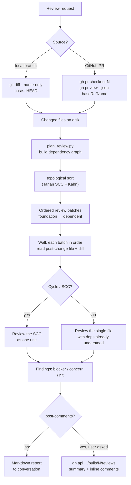
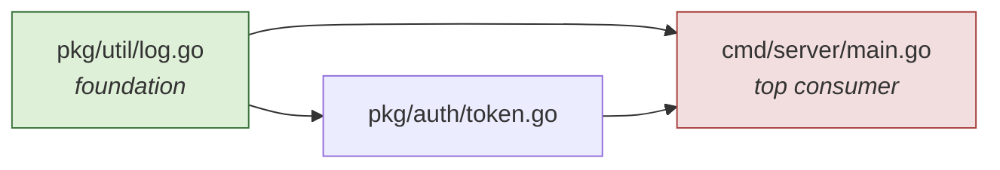
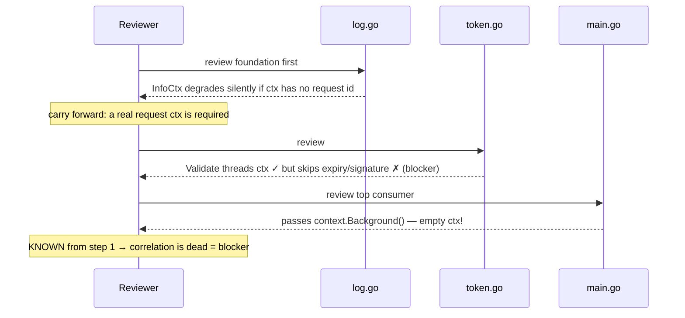
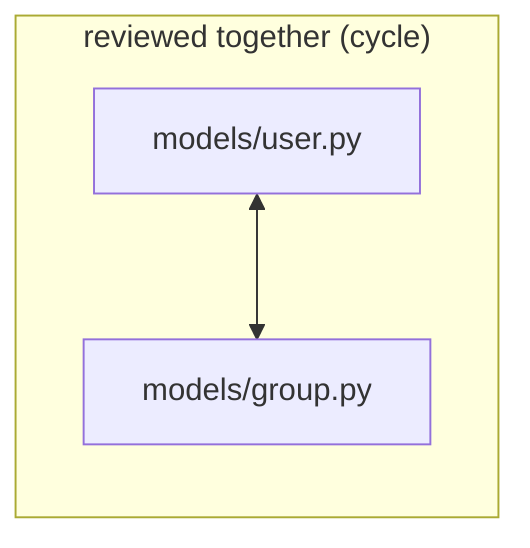

# Diagrams

Visual reference for how `pr-review-topo` works. All diagrams below are
[Mermaid](https://mermaid.js.org/) and render directly on GitHub.

## 1. End-to-end workflow

How a review request flows through the skill, from either a local branch or a
GitHub PR, to a report (and optionally inline comments).

## 2. Why order matters (the core idea)

A dependency graph of changed files. Edges run **foundation → dependent**.
Reviewing bottom-up (dependent first) means judging `main.go` before you know
how `log.go` and `token.go` changed. Topological order flips that.

Review order produced: **1. log.go → 2. token.go → 3. main.go**

## 3. The payoff, as a sequence

By the time the reviewer reaches `main.go`, it already knows `InfoCtx`
silently no-ops without a seeded context — so `context.Background()` is an
obvious blocker instead of an innocuous-looking line.

## 4. Cycle handling

When changed files import each other, no single file is foundational. The
planner detects the strongly-connected component (Tarjan) and the review
treats it as one unit.

## 5. Live example

A real review produced by this skill, posted as inline comments on a GitHub PR
in topological order:

👉 https://github.com/AkshayJaitly/topo-pr-review-demo/pull/1

